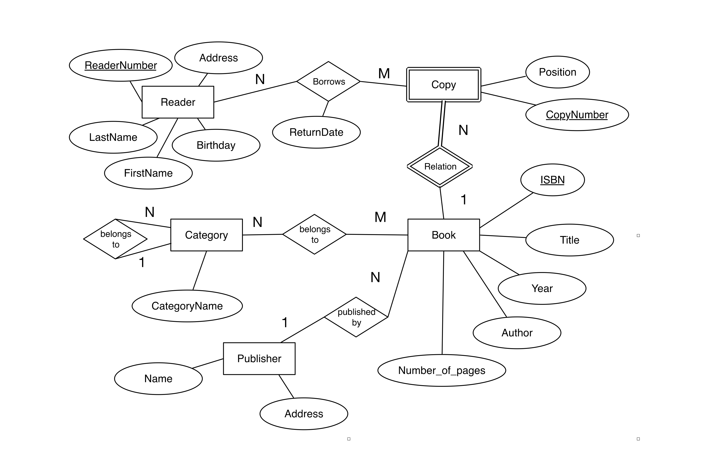
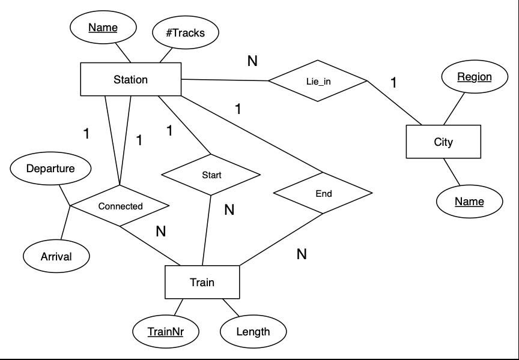
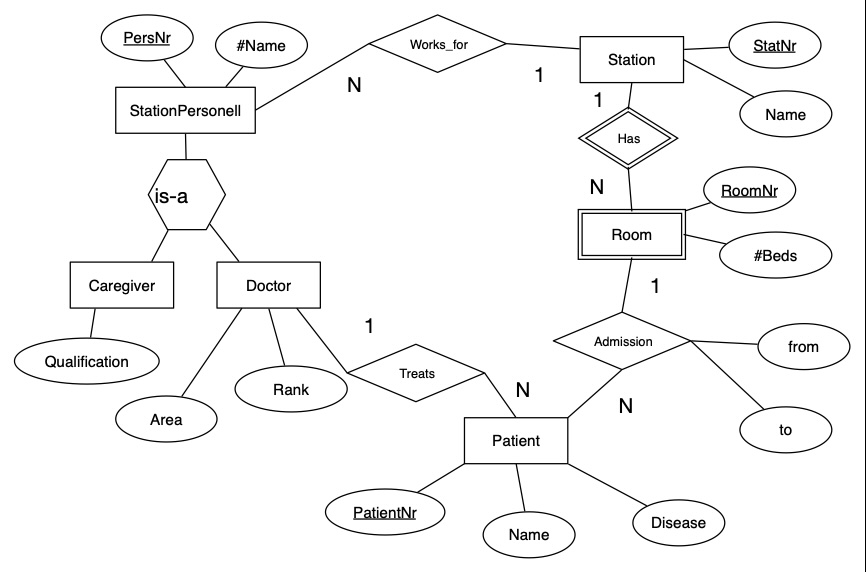

# Семинар 3: От E/R-диаграмм к реляционным схемам

Ответьте на теоретические вопросы в этом README и переведите три E/R-диаграммы ниже
в реляционные схемы в **DBML**. Редактируйте файлы в `src/` или используйте
[dbdiagram.io](https://dbdiagram.io). Пример синтаксиса: [example.dbml](example.dbml).

## Как выполнить и сдать задания

1. Откройте свой репозиторий задания на GitHub и скопируйте его URL из меню **Code → HTTPS**.
   Подставьте его вместо `<URL_ВАШЕГО_РЕПОЗИТОРИЯ>` и выполните:

   ```bash
   git clone <URL_ВАШЕГО_РЕПОЗИТОРИЯ> seminar-3
   cd seminar-3
   git switch -c seminar-3-solution
   ```

2. Заполните ответы ниже и три файла `src/`. Проверьте, что схемы открываются в dbdiagram.io.
3. Сохраните изменения и отправьте ветку на GitHub:

   ```bash
   git add README.md src/
   git commit -m "Выполнен семинар 3"
   git push -u origin seminar-3-solution
   ```

4. В своём репозитории на GitHub откройте **Pull requests → New pull request**.
   Выберите `base: main` и `compare: seminar-3-solution`, нажмите **Create pull request**.
   Назовите PR «Семинар 3» и оставьте его открытым для проверки преподавателем.

   PR также можно создать через терминал. Установите [GitHub CLI (`gh`)](https://cli.github.com/),
   затем в папке репозитория выполните:

   ```bash
   gh auth login
   gh pr create --base main --head seminar-3-solution --title "Семинар 3" --body "Ответы находятся в README.md, схемы — в src/."
   ```

   `gh auth login` нужен при первом входе в GitHub CLI. Достаточно одного способа создания PR: через сайт или CLI.

## Теоретические вопросы

Замените каждый комментарий `<!-- Ваш ответ -->` своим ответом. Сохраните заголовки вопросов.

### 1. Почему любое отношение в реляционной модели имеет хотя бы один ключ?

<!-- Ваш ответ -->

### 2. Почему для связи «многие ко многим» нужны промежуточные таблицы?

<!-- Ваш ответ -->

### 3. Когда оправдан автоинкремент, а когда лучше естественный или составной первичный ключ?

<!-- Ваш ответ -->

## Практические задания

Источник требований — **диаграммы ниже**. Сохраните их атрибуты, ключи и кратности связей.

- Укажите типы столбцов, первичные и внешние ключи. Для составных ключей используйте `indexes`.
  При добавлении суррогатного ключа сохраните уникальность естественного.
- Связи M:N реализуйте промежуточными таблицами, а `is-a` — отдельными таблицами общего типа и подтипов.
- Для автопроверки сохраняйте названия сущностей и атрибутов с диаграмм.
  Регистр, пробелы, подчёркивания и символ `#` не важны.
  Названия промежуточных таблиц и добавленных столбцов выбирайте сами.

### Задача 1: Библиотечная система



Учтите, что номер экземпляра уникален только в пределах книги, а категории образуют иерархию.

**Файл для выполнения:** [src/library_system.dbml](src/library_system.dbml)

### Задача 2: Расписание поездов



У города составной ключ: название и регион. В связи `Connected` станция участвует в двух ролях:
откуда и куда едет поезд; время отправления и прибытия относится к этому участку пути.

**Файл для выполнения:** [src/train_schedule.dbml](src/train_schedule.dbml)

### Задача 3: Станция скорой помощи



Номер палаты уникален в пределах станции. Сохраните специализацию персонала и даты размещения пациента в палате.

**Файл для выполнения:** [src/ambulance.dbml](src/ambulance.dbml)

## Автопроверка

GitHub Classroom запускает тесты при отправке изменений. Максимум — **10 баллов**:

| Проверка | Баллы |
| --- | ---: |
| Наличие трёх ответов на теорию | 1 |
| Библиотека: таблицы, атрибуты и ключи / связи | 1 / 2 |
| Поезда: таблицы, атрибуты и ключи / связи | 1 / 2 |
| Скорая помощь: таблицы, атрибуты и ключи / связи | 1 / 2 |

Тесты проверяют синтаксис DBML и основные ограничения схем. Содержание ответов и полноту модели проверяет преподаватель.
Для локального запуска нужен Node.js 22 или новее:

```bash
npm ci
npm test
```

Справочник: [синтаксис DBML](https://dbml.dbdiagram.io/docs/).
